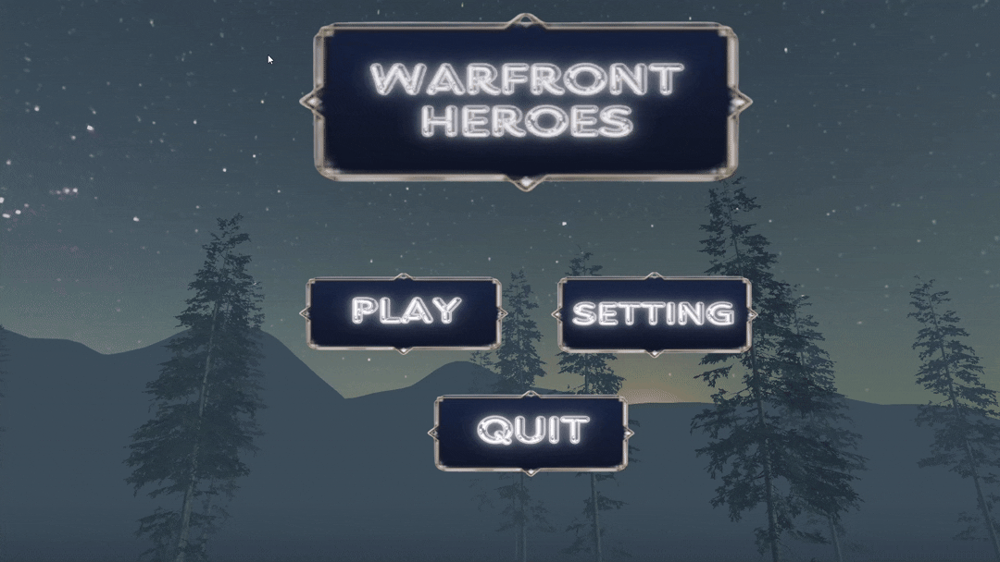

 
<h1 align="center">WarFront Heroes</h1>
<p align="center">Simple medical simulation game where players assume the role of a medic on the battlefield. 
  Your main mission is to move quickly and smartly amidst the chaos to locate and provide first aid to wounded soldiers, 
  according to their medical condition. </p>

## 🎮 Play
if you want to try playing it first, you can try playing it through the link below
🔗 [Play Now](https://rfito.itch.io/warfront-heroes)

## ⚙️ Installation & Usage

Follow these steps to set up and run WarFront Heroes on your local machine using Unity Editor.

### Prerequisites

* **Unity Editor:** This project was developed using **Unity Editor version `2022.3.32.f1`**.
    * It is **highly recommended** to install the exact same Unity Editor version via Unity Hub to avoid compatibility issues.
    
### Step-by-Step Guide

1.  **Clone the Repository:**
    Start by cloning the project to your local machine using Git. Open your **Git Bash / Command Prompt / Terminal** and run:
    ```bash
    git clone https://github.com/rrfito/WarFront-Heroes.git
    cd WarFront-Heroes
    ```
    **Note** : or you can click the `code button` on the top right and select the `Zip download`.

2.  **Open Project in Unity Hub:**
    * Launch **Unity Hub**.
    * Click the **"Add Project"** button (usually in the upper right or left corner).
    * Navigate to the root folder of the `WarFront-Heroes` project that you just cloned.
    * Select this root folder (the one containing `Assets`, `Packages`, `ProjectSettings`, etc.) and click **"Add Project"**.
                                                                                                                          
3.  **Launch the Project in Unity Editor:**
    * Click on the project name **"WarFront Heroes"** in Unity Hub.
    * The Unity Editor will begin loading the project. On the first opening after a clean clone, Unity will need to regenerate the `Library/` folder, import assets, and perform initial compilation. This process can take several minutes depending on the project size and your computer's specifications. Please be patient.

5.  **Run the Game:**
    * Once the Unity Editor has fully loaded, navigate to the `Assets/Scenes` folder in the **Project window**.
    * Double-click on your main game scene `MainMenu.unity`to open it in the **Scene view**.
    * Click the **Play** button (the triangle icon) at the top of the Unity Editor to run the game directly within the editor.

## 🔨 Building the Game

To create a standalone executable (a runnable application) of "WarFront Heroes":

1.  Open the project in the Unity Editor.
2.  Go to **File > Build Settings...**
3.  Select your desired target platform (e.g., `PC, Mac & Linux Standalone`).
4.  Ensure all necessary scenes for your game are added to the "Scenes In Build" list. Drag and drop them from the Project window if needed.
5.  Choose your desired architecture (e.g., `x86_64` for 64-bit).
6.  Click the **"Build"** button.
7.  Select a folder to save your game build. It is recommended to create a new `Builds` folder outside your main Unity project directory.
8.  Wait for the build process to complete. The executable file or installation package will be found in the chosen folder.

## ▶️ Gameplay Video

Watch the "WarFront Heroes" gameplay in action!

**Note** : This gameplay video uses Indonesian language

<a href="https://www.youtube.com/watch?v=njoR7RS-4GQ">
  
</a>
